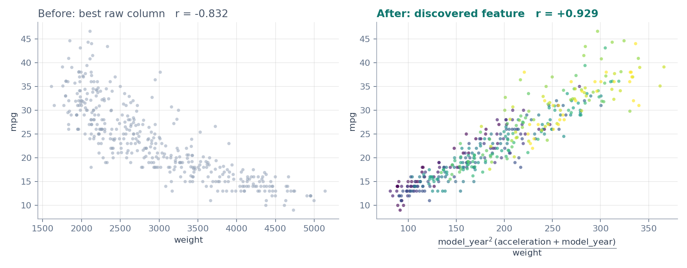
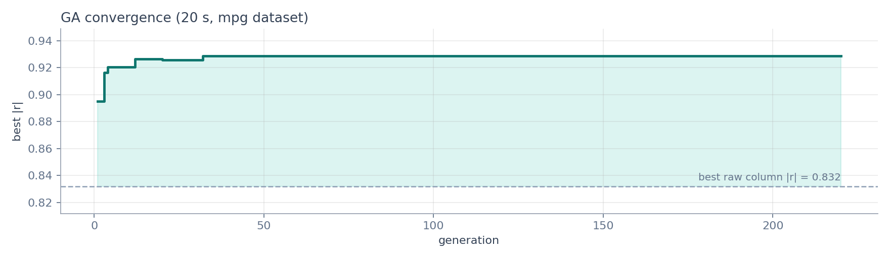
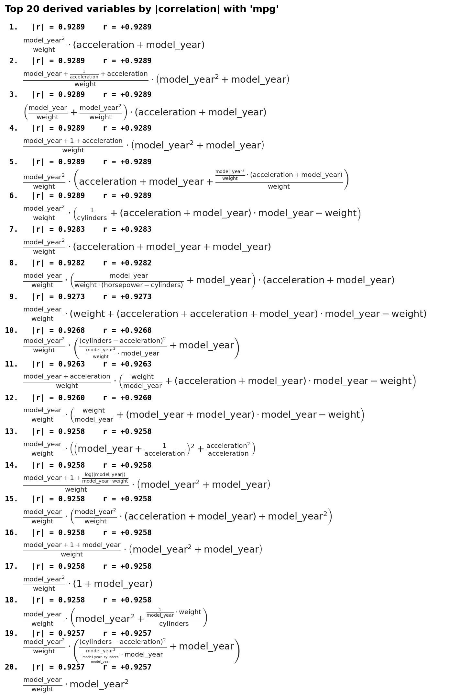
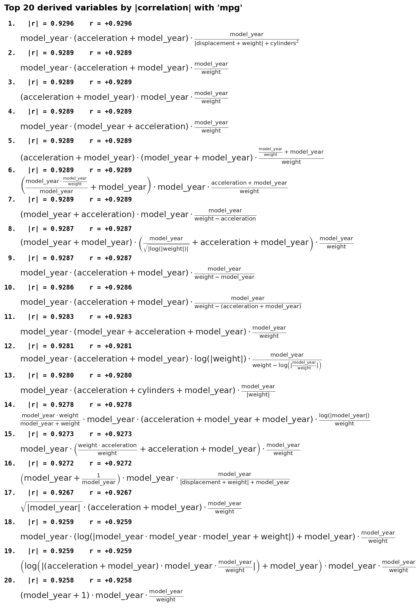

<p align="center">
  
</p>

<p align="center">
  
  
  
  <a href="LICENSE"></a>
</p>

<p align="center">
  CSV や Parquet の列を <b>+ − × ÷</b> などで組み合わせて、<br>
  目的変数と<b>いちばん強く相関する式</b>を遺伝的アルゴリズムで探します。
</p>

---

## ✨ 何ができるか

たとえば車の燃費データ（`mpg.csv`）で、燃費 `mpg` と相関が最も強い列は `weight`（r = −0.832）です。
このツールに 20 秒探索させると、次の式が見つかります。

$$
\frac{\mathrm{model\\_year}^2 \cdot (\mathrm{acceleration} + \mathrm{model\\_year})}{\mathrm{weight}}
\qquad r = +0.929
$$

<p align="center">
  
</p>

<sub>右図の点の色は <code>model_year</code>（紫 = 古い、黄 = 新しい）。「重いほど燃費が悪い」に「新しい車ほど燃費が良い」が掛け合わさった式になっています。</sub>

## 🧬 しくみ

<p align="center">
  
</p>

- 候補の式は**二分木**で表します（葉 = 列、節 = 演算子）
- 評価は **|相関係数|**。木が大きすぎる式には少しだけペナルティ（`--size-penalty`）
- 0 除算や log(0) は NaN として扱い、その式は無効にします

<p align="center">
  
</p>

<sub>最初の数十世代で、生の列の最良値（点線）を大きく上回ります。</sub>

## 🔧 2 つのエンジン

| | `ga_feature_search.py` | `ga_pysr_search.py` |
|---|---|---|
| 探索方法 | 自前の遺伝的アルゴリズム | [PySR](https://github.com/MilesCranmer/PySR)（Julia 製の記号回帰） |
| 必要なもの | NumPy / pandas / matplotlib | 左に加えて PySR（初回に Julia を自動インストール） |
| 最適化の対象 | \|相関係数\| | 予測誤差 → パレート解を \|相関係数\| で並べ替え |
| 二項演算 | `+ − × ÷` | `+ − × ÷` |
| 単項演算 | `log` `sqrt` `x²` `1/x` `abs` | `log` `sqrt` `x²` `1/x` `abs` |
| 向いている場面 | 手軽に試す・速く回す | 複雑な式まで本気で探す |

## 🚀 使い方

### インストール

リポジトリを clone したら、そのフォルダで次を実行します。

```bash
python -m venv .venv
source .venv/bin/activate
pip install -r requirements.txt
```

### 実行

```bash
# GA 版：20 秒だけ探す
python ga_feature_search.py mpg.csv --target mpg --time-limit 20

# 使う列を絞る
python ga_feature_search.py mpg.csv --target mpg \
  --columns cylinders displacement horsepower weight acceleration model_year

# PySR 版：60 秒探す
python ga_pysr_search.py mpg.csv --target mpg --time-limit 60
```

### 出力例

```text
gen  247 | best |r|=0.9289 | elapsed  20.0s
[stop] time limit 20s reached at generation 247

======================================================================
Top 5 derived variables by |correlation| with mpg
======================================================================
  1. |r|=0.9289  (r=+0.9289)
      ((((model_year + acceleration) * (model_year)^2) + (model_year / (model_year + model_year))) / weight)
  2. |r|=0.9289  (r=+0.9289)
      (((model_year + acceleration) * (model_year)^2) / weight)
  ...
Saved top 20 results image -> results.png
```

上位の式は数式として画像にも保存されます（保存先は `--output-image` で指定）。

<table>
  <tr>
    <th>GA 版の出力画像</th>
    <th>PySR 版の出力画像</th>
  </tr>
  <tr>
    <td></td>
    <td></td>
  </tr>
</table>

## ⚙️ 主なオプション

<details>
<summary><b>共通</b></summary>

| オプション | 既定値 | 説明 |
|---|---|---|
| `input` | — | 入力ファイル（CSV / Parquet） |
| `--target` | 必須 | 目的変数の列名 |
| `--columns` | 全列 | 探索に使う列 |
| `--time-limit` | なし | 探索時間の上限（秒） |
| `--top-k` | 10 | 画面に表示する件数 |
| `--image-top` | 20 | 画像に描く件数 |
| `--output-image` | `results.png` / `pysr_results.png` | 画像の保存先 |
| `--ascii-image` | off | 画像の数式を数式表記ではなくテキストで描く |
| `--seed` | なし | 乱数シード（再現用） |
| `--quiet` | off | 途中経過を表示しない |

</details>

<details>
<summary><b>GA 版（ga_feature_search.py）</b></summary>

| オプション | 既定値 | 説明 |
|---|---|---|
| `--generations` | 100 | 最大世代数 |
| `--population` | 300 | 個体数 |
| `--max-depth` | 3 | 式の木の最大の深さ |
| `--tournament-k` | 3 | トーナメント選択の大きさ |
| `--crossover-rate` | 0.7 | 交叉率 |
| `--mutation-rate` | 0.3 | 突然変異率 |
| `--elitism` | 2 | 毎世代そのまま残す上位の数 |
| `--size-penalty` | 0.001 | 木の大きさへのペナルティ |

</details>

<details>
<summary><b>PySR 版（ga_pysr_search.py）</b></summary>

| オプション | 既定値 | 説明 |
|---|---|---|
| `--iterations` | 40 | PySR の反復回数 |
| `--populations` | 15 | 集団の数 |
| `--population-size` | 33 | 集団あたりの個体数 |
| `--maxsize` | 25 | 式の複雑さの上限 |

</details>

## 📂 サンプルデータ

| ファイル | 中身 |
|---|---|
| `mpg.csv` | Auto MPG データセット（車の燃費と諸元、398 台） |
| `sample.csv` | 動作確認用の人工データ（列 `a` `b` `c` `d` と目的変数 `y`） |

## 📝 ライセンス

[MIT](LICENSE)
